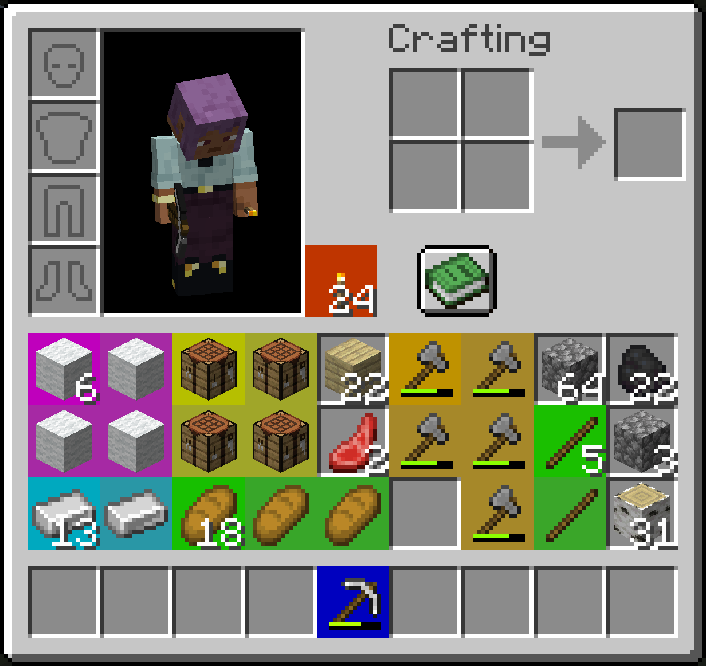
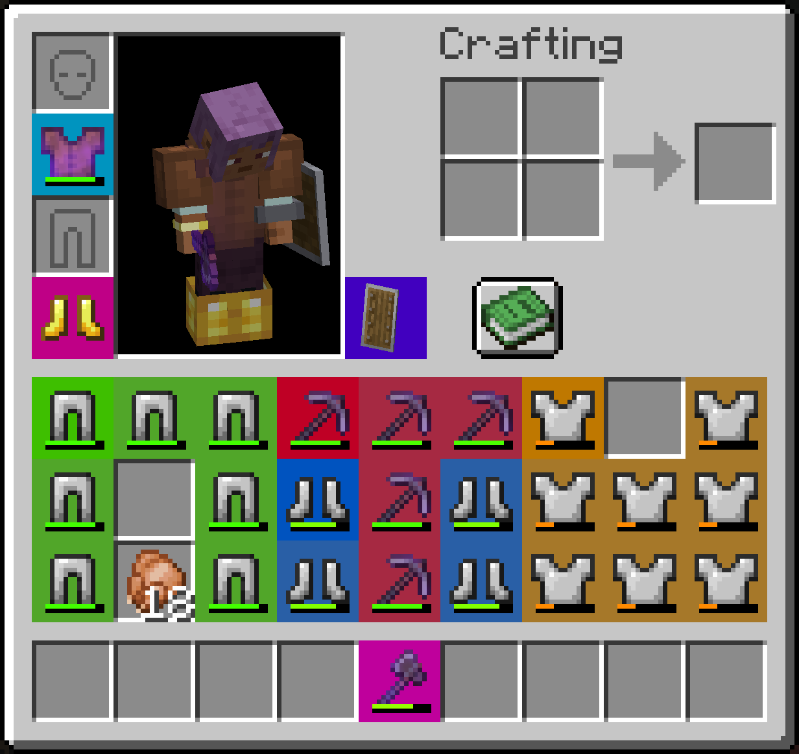
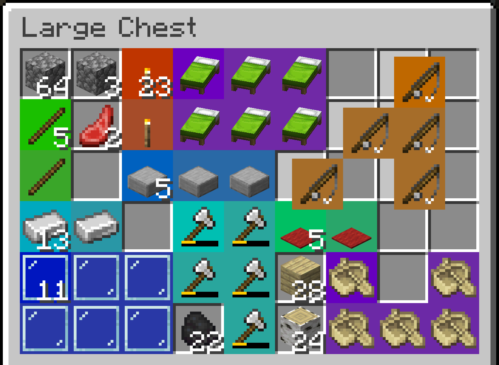
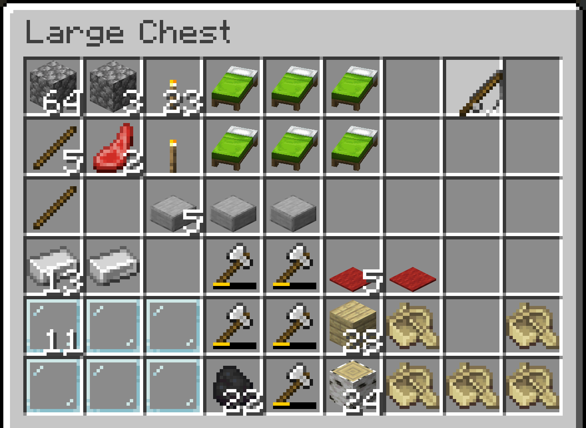

# Spatial

Spatial is a server side Fabric mod that converts the inventory system into a grid-based system. A spatial system.

So many mods these days are trying to fix the ever-growing problem that is the inventory. 
This mod is not one of those.
Spatial revolutionizes the way that you struggle to organize your inventory.

There is also a completely optional client side version that improves the rendering and overall cohesiveness of the experience.

## Screenshots




### With Optional Client Mod


### Without Optional Client Mod


## Configuration

The config file can be found in `./config/spatial.json`.

Overrides for shapes of items can be added in the config using by adding entries to `shape_overrides`.

### Shape Format

The format of shape overrides is similar to the format crafting recipes use for their shape.
Any character besides a space is treated as a slot the item occupies. Spaces are treated as empty slots.

An example config that gives goat horns an L shape.
```json
{
  ...
  "shape_overrides": {
    "minecraft:goat_horn": [
      "x ",
      "xx"
    ]
  },
  ...
}
```

### Brutal Mode

When enabled brutal mode disables stacking of **any** items.
Disabled by default.

## Mod Compatibility

Spatial will automatically detect all shaped recipes loaded at server start.
So no extra work is required for modded items that have shaped crafting recipes.

To avoid breaking modded inventories Spatial is only active in specific inventory screens.
This may be configurable in the future but as of right now it won't work in modded screens that don't extend a vanilla screen that has Spatial items enabled.

### Supported Screens

- Survival Player Inventory
- Chests
- Ender Chests
- Barrels
- Shulker Boxes
- Dispensers and Droppers
- Vehicle Inventories

### For Modders

If you want to add shape overrides for an item in your mod or another mod
you need to register a listener to `Spatial.SHAPES_LOADED` and call `Spatial.addShapeOverride(item, shape)` or any of the other shape override methods.

## License

This mod is licensed under the [MIT license](./LICENSE).